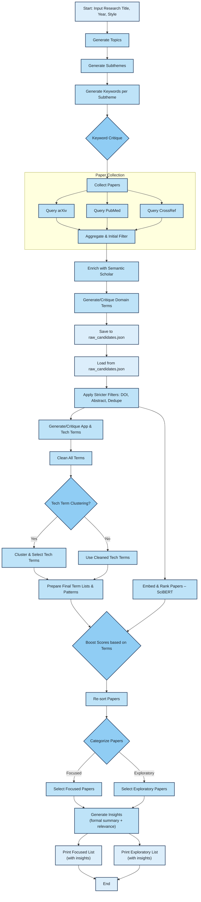

# 📄 Authematic: (Automatic + Thematic)

Authematic is a lightweight, agent-driven assistant that takes a research paper title as input and produces two curated lists of the most relevant academic papers:

1. **Focused Top 20**: Papers that match both your application domain and your chosen technique keywords.  
2. **Exploratory Top 10**: Broader domain-only matches that add methodological or interdisciplinary insights.

**Features:** 

1. Interactive web interface with chat-based interactions
2. Multi-source academic paper retrieval (arXiv, Semantic Scholar)
3. Semantic ranking using SciBERT embeddings
4. Intelligent filtering and categorization
5. Customizable year cutoff for recency control

Under the hood, it uses LLM calls (Gemini), arXiv & Semantic Scholar scraping, SciBERT embeddings, and a small amount of TF-IDF + heuristic boosting to maximize both precision and coverage.

---

## ⛓️ Pipeline Flow

Outlined below is the step-by-step execution flow of the AI-powered literature curation pipeline. The pipeline starts with a research title and ends with a ranked and categorized list of academic papers.

1.  **Initialization & User Input**:
    * Environment variables (including API keys) are loaded from a `.env` file.
    * API clients are initialized and managed via `api_client_manager.py`, setting up a round-robin system for using available Gemini API keys.
    * The `run_pipeline.py` script starts by prompting the user for the **research title**, a **publication year cutoff**, and the desired **citation style**.

2.  **Topic & Subtheme Generation**:
    * Using the input title, `paper_collector.py` calls the Gemini API (via `api_client_manager.py`) to generate **4 high-level academic topics** (Core, Adjacent, Emerging).
    * For each of these topics, it again calls the Gemini API to generate up to **3 sub-themes** or research niches.

3.  **Initial Keyword Generation**:
    * For each "Topic ▶ Subtheme" pair, `paper_collector.py` calls the Gemini API to generate up to **5 specific search keywords**.
    * The results are structured as a nested dictionary and saved temporarily to `keywords_by_subtheme.json`.

4.  **Keyword Critique & Refinement**:
    * The `keyword_critic.py` module is invoked for each sub-theme's keyword list.
    * It sends the list to the Gemini API, asking it to act as a critic, **removing broad/redundant terms** and **suggesting replacements**.
    * The refined (kept + suggested) keywords are used for the next step.

5.  **Paper Collection & Aggregation**:
    * The `collect_papers` function in `paper_collector.py` orchestrates the fetching.
    * It iterates through each sub-theme and its refined keywords.
    * For each keyword, it concurrently queries multiple literature sources (**arXiv**, **PubMed**, **CrossRef**) using a `ThreadPoolExecutor`. *Semantic Scholar is noted as excluded for initial search but used later for enrichment*.
    * Each source fetches a set number of papers per keyword per attempt/offset.
    * As papers are fetched, they are **filtered by year** and checked for **valid DOI and abstract**. They are also **deduplicated within each source's batch**.
    * Papers are added to their respective sub-theme "bucket" until a minimum target is reached, with global deduplication within the bucket.

6.  **Data Enrichment**:
    * After collection, all papers are pooled together.
    * The `enrich_with_semantic_scholar` function is called to **fetch missing abstracts or author details** for papers using their DOIs.

7.  **Intermediate Save & Load**:
    * `paper_collector.py` generates initial **domain terms** using the Gemini API, which are then critiqued via `keyword_critic.py`.
    * The collected (and enriched) papers, the query title, and the critiqued domain terms are saved to `raw_candidates.json`.
    * This JSON file is immediately reloaded using `load_candidates_from_json` in `filter_and_rank.py`.

8.  **Initial Filtering**:
    * The loaded papers undergo stricter filters using `filter_and_rank.py`:
        * `filter_by_doi`: Ensures a valid DOI exists.
        * `filter_by_abstract`: Ensures a valid abstract exists.
        * `dedupe_by_doi`: Performs a final global deduplication.

9.  **Application & Technique Term Generation**:
    * `paper_collector.py` calls the Gemini API to generate **application-centric terms** and **technique/methodology terms**.
    * These lists are also critiqued using `keyword_critic.py`.
    * The critiqued lists (along with domain terms) are further **cleaned** using internal stop-word lists.

10. **Technique Term Clustering (Optional)**:
    * If enough technique terms exist, their **SciBERT embeddings** are calculated using `embeddings.py`.
    * **K-Means clustering** is applied to group similar techniques.
    * A smaller, **representative set of technique terms** is selected.

11. **Semantic Ranking & Boosting**:
    * All filtered papers are ranked using `semantic_rank_papers` from `filter_and_rank.py`.
    * This involves getting **SciBERT embeddings** for each paper (`embeddings.py`) and calculating **cosine similarity** against the query.
    * Scores are then **boosted** if a paper matches application or technique terms.
    * Papers are re-sorted based on boosted scores.

12. **Categorization**:
    * **Regex patterns** are created for application, technique, and domain terms.
    * Papers are categorized into:
        * **Focused Papers**: Matching a combination of Application, Technique, and Domain terms.
        * **Exploratory Papers**: Matching Domain and/or Technique terms, excluding those already in 'Focused'.
    * The pipeline prints the top **Focused** and **Exploratory** papers (title, year, score, DOI) to the console.
    * The total execution time is reported.
   
13.  **Insight Generation**:
   * Each individual paper is passed to `generate_insights` from `extract_insights.py`, which returns:
     * A formal academic summary of the abstract.
     * A second-person explanation of how the paper supports or relates to the user’s research title.
   * These insights are embedded into the paper’s data structure under the keys `insight` and `relevance`.



---

## 📂 Project Structure

```
└── team-Autonominds-2025/
    ├── .env
    ├── AUTHEMATIC CHANGELOG.txt
    ├── api_client_manager.py
    ├── embeddings.py
    ├── extract_insights.py
    ├── filter_and_rank.py
    ├── keyword_critic.py
    ├── keyword_generation.py
    ├── paper_collector.py
    ├── README.md
    ├── run_pipeline.py
    └── web_app/
        ├── .env
        ├── app.py
        ├── keywords_by_subtheme.json
        ├── requirements.txt
        ├── static/
        │   ├── css/
        │   │   └── style.css
        │   └── js/
        │       └── main.js
        └── templates/
            ├── base.html
            └── index.html
```

### Core Modules

#### 1. `paper_collector.py`

- **LLM prompts** (Gemini) for topic and keyword generation
- **Fetch functions** for arXiv and Semantic Scholar
- **Collection orchestration** for multi-source retrieval

#### 2. `filter_and_rank.py`

- **JSON loading and validation**
- **Filtering functions** for DOI, abstract, and deduplication
- **Semantic ranking** using SciBERT embeddings
- **Heuristic boosting** for domain relevance

#### 3. `embeddings.py`

- SciBERT wrapper for generating 768-dim embeddings
- In-memory caching for performance

#### 4. `run_pipeline.py`

- **CLI interface** for pipeline execution
- **Term extraction and cleaning**
- **Result categorization and display**

---

## 🔧 Installation & Setup

### Core Requirements

1. **Clone the repo**  
   ```bash
   git clone https://github.com/GenAIPHBuilders-org/team-Autonominds-2025.git
   cd team-Autonominds-2025
2. **Create & activate a Python 3.10+ virtual environment**
   ```python
   python -m venv venv
   source venv/bin/activate     # Linux / macOS
   venv\Scripts\activate.bat    # Windows
   ```
   
3. **Install dependencies**
   ```python
   pip install python-dotenv google-genai requests feedparser transformers torch numpy scikit-learn joblib flask flask-socketio
   ```
4. **Set up your Gemini API key
   Create a .env file in the project root with your Gemini API key:**
   ```
   GEMINI_API_KEY=your_api_key_here
   ```

## 🚀 Usage
### Command Line Interface
Run the pipeline directly from the command line:
```python
python run_pipeline.py
```

Follow the prompts to enter:

1. Your research paper title
2. Publication year cutoff
3. (Optional) Citation style

### Local Web Application
You can also run the pipeline through a small Flask web interface. The UI is styled with a modern "chatbot" look using the Inter font and a soft blue/mint gradient:

```bash
export FLASK_APP=web_app/app.py
flask run
```

Open `http://localhost:5000` in your browser and submit the form with your
research title, cutoff year and citation style. The top Focused and Exploratory
papers will be displayed in the results page.

## 🔍 Troubleshooting
- `API Key Issues`: Ensure your Gemini API key is correctly set in the .env file
  - Be informed that we recommended you use the .env keys as uploaded in this repo. We used two API clients with round-robin substitution system to handle rate limit exhaustion.
- `Missing Directories`: The web app will automatically create required directories
- `Model Downloads`: The first run may take longer as it downloads SciBERT

## ✅ Test Case
```
Research Title: Self-Supervised Learning Approaches for 3D Point Cloud Understanding
Cutoff Year: 2015
```
Upon running the pipeline with the above inputs, the system should:

1. Generate relevant academic topics, subthemes, and refined search keywords.
2. Fetch and filter papers from academic sources such as arXiv, PubMed, and CrossRef.
3. Perform semantic ranking and categorize papers into Focused and Exploratory groups.
4. Analyze all top papers to extract:
   - AI-generated academic insights and relevance explanations.
5. Output ranked papers and paper-level insights to the web interface and console.

## 🤝 Contributing

1. Fork the repository
2. Create a feature branch: `git checkout -b feature-name`
3. Commit your changes: `git commit -m 'Add some feature'`
4. Push to the branch: `git push origin feature-name`
5. Open a pull request


## 🤓 Team Members

- **Vhien Anuta** (Team Representative) - [Github](https://github.com/algo-boy)
- **Raphael Gio Acupan** (AI Integration Engineer) - [Github](https://github.com/GioAcupan)
- **Princess Joeby Arabis** (Front-end Developer) - [Github](https://github.com/PrincessA29)
- **Yuri Alfrance Egipto** (Front-end Developer) - [Github](https://github.com/yurialfrance)
